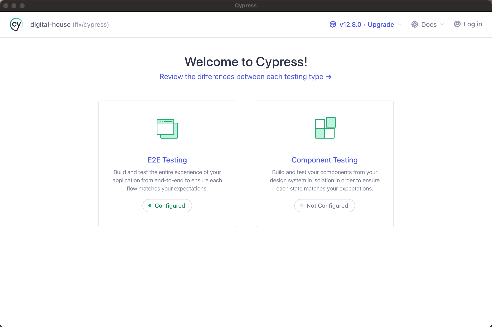
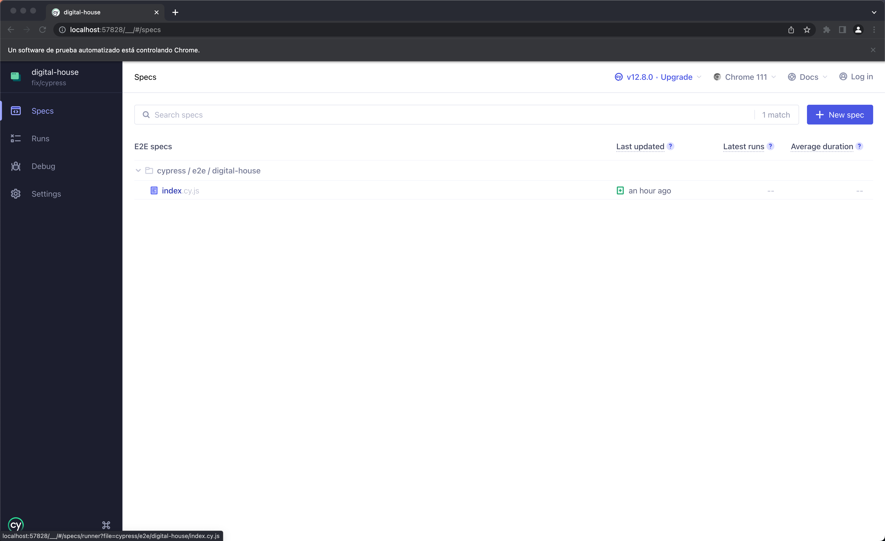

## DIGITAL HOUSE CHALLENGE

Thanks for this opportunity and let me show some of my pasion.

This is a [React Native](https://reactnative.dev/) project.

## Getting Started

First, after clone this repo, run the development server:

**_NOTE:_** Create file `.env` with data in `.env-example`

```bash
npm i
# and
npm run:ios
# or
npm run:android
# and for test
npm run test
```

#### Available Scripts 💻

In the project directory, you can run:

- `npm i` (Install all dependencies)
- `npm run:ios` (Runs the app in the ios emulator in development mode.)
- `npm run:android` (Runs the app in the android emulator in development mode.)
- `npm test` (Runs the tests above app.)
- `npm test:coverage` (Runs the tests above app and get a coverage report.)

- Node Version: v16.15.1
- NPM Version: v8.11.0

This site was inspired at Figma to [DIGITAL HOUSE](https://www.figma.com/proto/AIMJp1Y6Gfv9PmQ8lYmUy8/Code-challenge?node-id=6%3A649&scaling=scale-down&page-id=0%3A1&starting-point-node-id=6%3A649)

#### Inspirations 🤯 🧠

- 🌈 🌎 Vitto 🌎 🏹
- Midudev: [midudev - Youtube](https://www.youtube.com/channel/UC8LeXCWOalN8SxlrPcG-PaQ)
- FaztWeb: [FaztWeb](https://www.faztweb.com/)
- Feranndo Herrera: [Ferando Herrera - Youtube](https://www.youtube.com/c/FernandoHerreraCr)
- Simon Grimm: [Simon Grimm - Youtube](https://www.youtube.com/channel/UCZZPgUIorPao48a1tBYSDgg)

### Tools 🧩

- VSCode: [https://code.visualstudio.com/](https://code.visualstudio.com/)
- React Native: [https://reactnative.dev/](https://reactnative.dev/)
- Postman: [https://www.postman.com/](https://www.postman.com/)
- Jest: [https://jestjs.io/](https://jestjs.io/)
- StackOverflow: [https://stackoverflow.com/](https://stackoverflow.com/) 😅
- OSX Macbook

#### Cypress 📎

**_NOTE:_** Project has Cypress to e2e tests. To run pleas follow next steps:

```bash
# after install dep
npm run web
# and in other terminal:
npx cypress open
# continue in virtual platform Cypress
```

#### Select E2E Testing



#### Select Configure, use Chrome and Start E2E


#### In new window opnede click in 'index' and get e2e process



#### Coverage 🔍


#### Screenshots 📱


Sebastian Roger Loguzzo! 🌎
